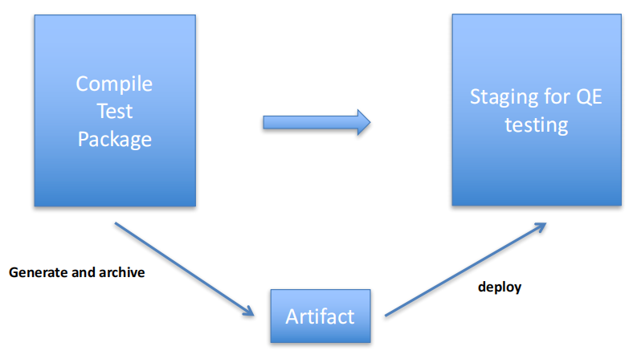
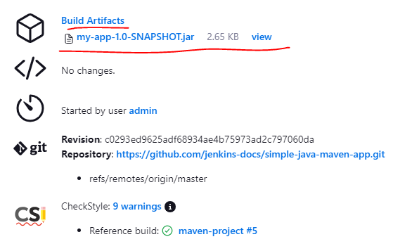
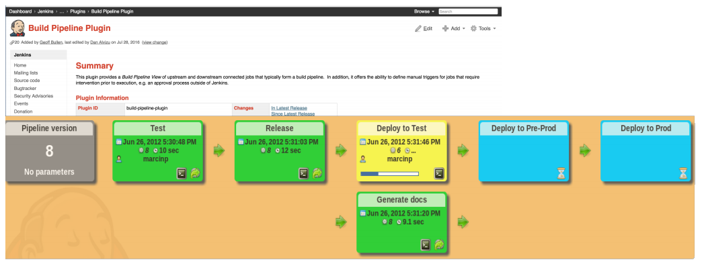
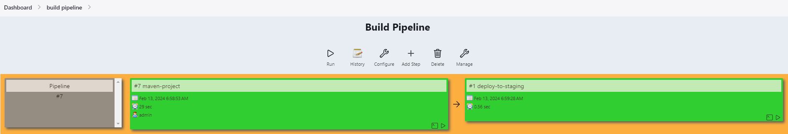
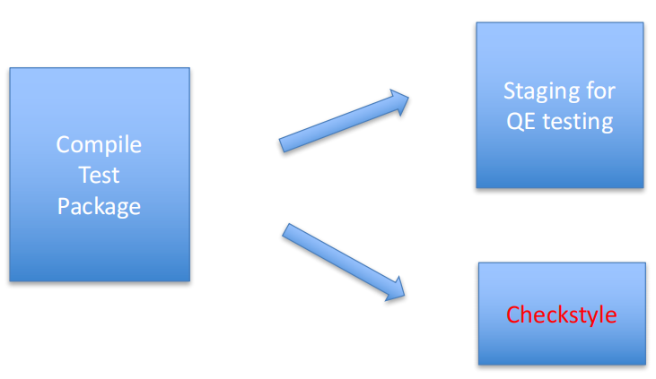

# Jenkins

> This is a tutorial course covering Jenkins and CI/CD pipeline.

Tools used:

- JDK 11
- Maven
- JUnit 5, Mockito
- IntelliJ IDE
- Jenkins

## Table of contents

1. [Continuous Integration With Jenkins](https://github.com/backstreetbrogrammer/48_Jenkins?tab=readme-ov-file#chapter-01-continuous-integration-with-jenkins)
    - [Continuous Integration Overview](https://github.com/backstreetbrogrammer/48_Jenkins?tab=readme-ov-file#continuous-integration-overview)
    - [Install Jenkins](https://github.com/backstreetbrogrammer/48_Jenkins?tab=readme-ov-file#install-jenkins)
    - [Jenkins Overview](https://github.com/backstreetbrogrammer/48_Jenkins?tab=readme-ov-file#jenkins-overview)
2. [Maven-Based Jenkins Job](https://github.com/backstreetbrogrammer/48_Jenkins?tab=readme-ov-file#chapter-02-maven-based-jenkins-job)
3. [Continuous Inspection With Jenkins](https://github.com/backstreetbrogrammer/48_Jenkins?tab=readme-ov-file#chapter-03-continuous-inspection-with-jenkins)
4. [Continuous Delivery With Jenkins](https://github.com/backstreetbrogrammer/48_Jenkins?tab=readme-ov-file#chapter-04-continuous-delivery-with-jenkins)
    - [Jenkins Build Pipeline](https://github.com/backstreetbrogrammer/48_Jenkins?tab=readme-ov-file#jenkins-build-pipeline)
5. [Jenkins Pipeline As Code](https://github.com/backstreetbrogrammer/48_Jenkins?tab=readme-ov-file#chapter-05-jenkins-pipeline-as-code)

---

## Chapter 01. Continuous Integration With Jenkins

### Continuous Integration Overview


- Developers commit code to a shared repository on a regular basis
- Version control system is being monitored
- When a commit is detected, a build will be triggered automatically
- If the build is not green, developers will be notified immediately

**Advantages:**

- Detect problems or bugs, as early as possible, in the development life cycle
- Since the entire code base is integrated, built and tested constantly, the potential bugs and errors are caught
  earlier in the life cycle which results in better quality software

**_Different stages of adopting CI_**

**Stage 1**

- No build servers: developers build their application on their local servers
- Developers do NOT commit to the central repository on a regular basis
- Before the release, changes are integrated and tested manually
- There are very few releases

**Stage 2**

- Build servers are present and automated builds are scheduled on a regular basis (say, nightly)
- Build script compiles the application and runs a set of **automated tests**
- Developers now commit their changes regularly
- Build servers would alert the team members in case of build failure

**Stage 3**

- A build is triggered **automatically** whenever new code is committed to the central repository
- Broken builds are usually treated as a high-priority issue and are fixed quickly

**Stage 4**

- Automated **code quality and code coverage** metrics are now run along with unit tests to continuously evaluate the
  code quality
- With the increase in code quality and code coverage, we will notice that we have fewer and fewer build failures

**Stage 5**

- Automated **Deployment**: the deployment process should be automated, with no manual steps involved
- Fixing broken builds should be treated as a high-priority issue for all team members
- All team members should focus on contributing to high-quality tests because the confidentiality of the CI process
  highly depends on the quality of the tests

**_Difference between Continuous Integration, Continuous Delivery, Continuous Deployment_**

**Continuous Integration**

> The practice of merging development work with the main branch constantly.

**Continuous Delivery**

> Continual delivery of code to an environment once the code is ready to ship. This could be staging or production. The
> idea is the product is delivered to a user base, which can be QAs or customers for review and inspection.

**Continuous Deployment**

> The deployment or release of code to production as soon as it is ready.

### Install Jenkins

- Navigate to [Jenkins Download](https://www.jenkins.io/download/#downloading-jenkins)
- Download Jenkins `2.426.3 LTS` for Windows: `jenkins.msi`
- Install using the msi installer
- Logon Type can be marked as: `Run service as LocalSystem`
- Select all the defaults and install

**Verify**

- Launch on browser: `http://localhost:8080/`
- The Login page will come where we need to type the admin password located at:

`C:\ProgramData\Jenkins\.jenkins\secrets\initialAdminPassword`

- Follow the defaults — we can skip all the plugin installations for now
- Once the setup is complete, Jenkins dashboard will display
- For now, click on `admin` user in the top-right and change the password in `Configure`
- Jenkins will be logged in again with the new password

### Jenkins Overview

- Jenkins is a continuous integration and build server written in Java
- It is used to manually, periodically, or automatically build software development projects
- Jenkins is used by teams of all different sizes, for projects with various languages

Jenkins is very popular because:

- Ease to use
- Great extensibility via plugins:
    - Support different version control systems
    - Code quality metrics
    - Build notifiers
    - UI customization

**_Jenkins Master-Slave Architecture_**


**Master:**

- Schedule build jobs
- Dispatch builds to the slaves for the actual job execution
- Monitor the slaves and record the build results
- Can also execute build jobs directly

**Slave:**

- Execute build jobs dispatched by the master

**_Jenkins Terminology_**

**Job or Project**

- Those two terms are used interchangeably. They all refer to runnable tasks that are controlled / monitored by Jenkins.

**Slave or Node**

- Slaves are computers that are set up to build projects for a master
- Jenkins runs a separate program called **"slave agent"** on slaves
- When slaves are registered to a master, a master starts distributing loads to slaves
- Node is used to refer to all machines that are part of Jenkins grid, slaves and master

**Executor**

- Executor is a separate stream of builds to be run on a node in parallel
- A Node can have one or more executors

**Build**

- A build is a result of one of the projects

**Plugin**

- A Plugin, like plugins on any other system, is a piece of software that extends the core functionality of the core
  Jenkins server

**_Jenkins UI Overview_**


- The Main Dashboard will display all the jobs, also called as `Job Table`
- Left pane consists of `Configuration Panel`, `Build Queue` and `Build Executor Status` panels
- Top `Header` can be used to login / logout / search / enable auto refresh etc.

**Configuration Panel**

- `New Item` is used to add a new job
- `People` is used to manage users
- `Build History` shows all the build history on master or slave nodes
- `Manage Jenkins` is the main page for doing all Jenkins configurations
- `My Views` can be used to provide a customized view for each user where only selected jobs can be displayed

**_Create our first Jenkins job_**

- Click on `Create a job` on Dashboard
- In the `Enter an item name` text box, write the job name as: `first-jenkins-job`
- Click on `Freestyle project` and press `OK` button
- Job's `Configuration` page will open with first tab as `General`
- In `Description` text box, we can write: `This is our first Jenkins job`
- For now, we will keep `Source Code Management` as `None`
- We will keep `Build Triggers` and `Build Environment` sections empty, i.e., we will trigger the build **manually**
- In the `Build Steps` section, click on `Add build step`
- Choose `Execute Windows batch command` on Windows, OR, choose `Execute shell` on MacOS / Linux
- Write the `Command`: `echo "Hello Guidemy students!!"`
- Click on `Save` button and our first job is created

**_Run our first Jenkins job_**

- Click the `Dashboard` and we will see our `first-jenkins-job` listed
- Click the right-most `play` button to build the job
- Click the `first-jenkins-job` and it will display our first build on the left pane in `Build History`
- Build job `#1` marked as green tick means its successful
- Click on `#1` -> `Console Output` to see the output


---

## Chapter 02. Maven-Based Jenkins Job

**Different Phases in Maven Build Lifecycle**

- **clean**: Delete all the target folders containing compiled binaries.
- **validate**: Validate the project is correct, and all necessary information is available.
- **compile**: Compile the source code of the project.
- **test**: Test the compiled source code using a suitable unit testing framework.
- **package**: Take the compiled code and package it in its distributable format.
- **verify**: Run any checks on results of integration tests to ensure quality criteria are met.
- **install**: Install the package into the local repository, for use as a dependency in other projects locally.
- **deploy**: Copy the final package to the remote repository for sharing with other developers and projects.

**Maven Build Phases**

- These lifecycle phases are executed **sequentially** to complete the default lifecycle.
- We want to specify the `maven clean package` command; this command would execute each default life cycle phase in
  order including `validate`, `compile`, `test` before executing package.
- We only need to call the **last** build phase to be executed.

We will create a maven-based jenkins job which will:

- check out source code from GitHub
- compile the code
- run the test
- package the application

**_Configure Java, Git and Maven in Jenkins_**

- Download and install `Git` (if not already installed) from [Git Downloads](https://git-scm.com/downloads)
- In Jenkins Dashboard, click `Manage Jenkins` -> `Plugins`
- We can search `GitHub` plugin and install it
- `GitHub` plugin will be showing up in `Installed` plugins
- Download and install `Maven` (if not already installed) from [Maven Downloads](https://maven.apache.org/download.cgi)
- In Jenkins Dashboard, click `Manage Jenkins` -> `Tools`
- In `JDK installations`, click `Add JDK` button
- Put `Name` as `localJDK` and `JAVA_HOME` as `C:\Program Files\Java\jdk-11.0.11`
- In `Git installations`, put `Name` as `localGit` and keep `path` as default `git.exe`
- In `Maven installations`, click `Add Maven` button
- Put `Name` as `localMaven` and `MAVEN_HOME` as `C:\Maven\apache-maven-3.9.4`
- Click on `Save` button, and we have configured our Java, Git and Maven installations

**_Create maven project job_**

- Click on `Create a job` on Dashboard
- In the `Enter an item name` text box, write the job name as: `maven-project`
- Click on `Freestyle project` and press `OK` button
- Job's `Configuration` page will open with first tab as `General`
- In `Description` text box, we can write: `This is our first maven project`
- In `Source Code Management`, use `Git`
- In Repository URL, type: `https://github.com/jenkins-docs/simple-java-maven-app.git`
- We will keep `Build Triggers` and `Build Environment` sections empty, i.e., we will trigger the build **manually**
- In the `Build Steps` section, click on `Add build step` -> `Invoke top-level Maven targets`
- Use `Maven Version` as `localMaven` and `Goals` as `clean package`
- Click on `Save` button

**_Run maven project job_**

- Click the `Dashboard` and we will see our `maven-project` listed
- Click the right-most `play` button to build the job
- Click the `maven-project` and it will display our first build on the left pane in `Build History`
- Build job `#1` marked as green tick means its successful
- Click on `#1` -> `Console Output` to see the output

**_Source control polling_**

We should understand **Cron syntax** to learn more about SCM polling in Jenkins.

In Cron, each line consists of **five** fields separated by **TAB** or **whitespace**.


To specify multiple values for one field:

- `*`: all valid values
- `M-N`: a range of values
- `M-N/X` or `*/X`: steps by intervals of `X` through the specified range or whole valid range
- `A,C,Z`: enumerates multiple values

Examples:

```
# every day at midnight
0 0 * * *

# 2 am, 3 am and 4 am every day
0 2-4 * * *

# Every fifteen minutes (perhaps at :07, :22, :37, :52):
H/15 * * * *

# Every ten minutes in the first half of every hour (three times, perhaps at :04, :14, :24):
H(0-29)/10 * * * *

# Once every two hours at 45 minutes past the hour starting at 9:45 AM and finishing at 3:45 PM every weekday:
45 9-16/2 * * 1-5

# Once in every two hour slot between 8 AM and 4 PM every weekday (perhaps at 9:38 AM, 11:38 AM, 1:38 PM, 3:38 PM):
H H(8-15)/2 * * 1-5

# Once a day on the 1st and 15th of every month except December:
H H 1,15 1-11 *
```

Let's configure our `maven-project` to trigger build whenever there is any change committed to the GitHub repository.

- Navigate to `maven-project` -> `Configure` -> `Build Triggers`
- Check `Poll SCM` checkbox and put following cron in `Schedule`:

```
* * * * *
```

- This cron means whenever any change is committed to GitHub, Jenkins build will be triggered **immediately**
- Click on **Save** button
- Now we will see a new `Git Polling Log` which will show the logs

**_Other Build Triggers_**

**Trigger builds remotely (e.g., from scripts)**

Enable this option if we would like to trigger new builds by accessing a special predefined URL (convenient for
scripts).

- In the `Authentication` text box, put token as `GUIDEMY`
- Copy the URL specified: `JENKINS_URL/job/maven-project/build?token=TOKEN_NAME`
- Replace `JENKINS_URL` with `http://localhost:8080` and TOKEN_NAME with `GUIDEMY`
- Click on `Save` button
- Launch the URL in browser: `http://localhost:8080/job/maven-project/build?token=GUIDEMY`
- We will see a new build triggered in `Build History` for our `maven-project`

**Build after other projects are built**

Set up a trigger so that when some other projects finish building, a new build is scheduled for this project. This is
convenient for running an extensive test after a build is complete, for example.

**Build periodically**

Provides a `cron-like` feature to periodically execute this project.

This feature is primarily for using Jenkins as a cron replacement, and it is not ideal for continuously building
software projects.

**GitHub hook trigger for GITScm polling**

This is the ideal settings used in production.

When Jenkins receives a GitHub push hook, GitHub Plugin checks to see whether the hook came from a GitHub repository
which matches the Git repository defined in the SCM/Git section of this job.

If they match and this option is enabled, GitHub Plugin triggers a one-time polling on GITScm.

When GITScm polls GitHub, it finds that there is a change and initiates a build.

The last sentence describes the behavior of Git plugin, thus the polling and initiating the build is not a part of
GitHub plugin.

All the details for setup is here: `https://plugins.jenkins.io/github/`

---

## Chapter 03. Continuous Inspection With Jenkins

Jenkins can be used to integrate **checkstyle** reports for code quality metrics.

Checkstyle is a **code static analysis tool** to help programmers to write Java code that adheres to a coding standard
such as:

- Avoiding multiple blank lines
- Removing unused variables
- Enforcing correct indentations
- etc.

Checkstyle is highly configurable and can be made to support almost any coding standard. An example configuration files
are supplied supporting the
[Sun Code Conventions](https://checkstyle.org/styleguides/sun-code-conventions-19990420/CodeConvTOC.doc.html),
[Google Java Style](https://checkstyle.sourceforge.io/styleguides/google-java-style-20180523/javaguide.html).

**_Configuring Checkstyle Plugin in Jenkins_**

[Checkstyle Jenkins Plugin](https://github.com/jenkinsci/checkstyle-plugin) has been deprecated.

However, all functionality has been integrated into the
[Warnings Next Generation Plugin](https://github.com/jenkinsci/warnings-ng-plugin) and the
[Static Analysis Model and Parsers Library](https://github.com/jenkinsci/analysis-model).

- In Jenkins Dashboard, click `Manage Jenkins` -> `Plugins`
- Search for `Warnings` and install
- This will install **Warnings Next Generation Plugin** and **Static Analysis Model and Parsers Library**
- Navigate to `maven-project` -> `Configure` -> `Build Steps`
- In our `localMaven`, set `Goals` as `clean package checkstyle:checkstyle`
- In `Post-build Actions`, choose `Record compiler warnings and static analysis results` and Tool as `CheckStyle`
- Click on `Save` button and trigger a build manually
- Once the build is successful, we can click the build tag
- There is a new `Checkstyle Warnings` tab which on clicking will give the complete checkstyle report

**Exercise**: Add a new plugin **Report Info**

> A view with some information from Surefire, PMD, Findbugs and Checkstyle reports.

**_Integration with Gradle_**

- Similar to Maven, Gradle is an open source build tool for the Java Virtual Machine
- Build scripts for Gradle are written in a **Domain Specific Language** based on Groovy
- The concise nature of Groovy scripting lets us write very expressive build scripts with very little code
- In Jenkins Dashboard, click `Manage Jenkins` -> `Plugins`
- Search for `Gradle` and install `Gradle Plugin`
- Now similar to maven-based project job, we can create a gradle-based project job

**_Integration with Shell_**

Jenkins has in-built support for bash shell.

For MacOS and Linux systems, we can use shell commands or scripts for build steps.

- In the project -> `Configure` -> `Build Steps`, we can use `Execute Shell`
- Runs a shell script (defaults to `sh`, but this is configurable) for building the project
- The script will be run with the workspace as the current directory

As the best practice, we should not put a long shell script in here.

Instead, we should add the shell script in SCM and simply call that shell script from Jenkins (via
`bash -ex myscript.sh` or something like that).

---

## Chapter 04. Continuous Delivery With Jenkins



We need to automate the deployment of artifacts to the test environment for Quality Assurance.

This can be done in `Post-build Actions` in Jenkins.

- Navigate to `maven-project` -> `Configure` -> `Post-build Actions`
- Add post-build action as `Archive the artifacts`
- Files to archive: either use `**/*.jar` or `target/*.jar`
- Click on `Save` button and trigger a new build manually
- Click on the build tag and we will see `Build Artifacts` being deployed



**_Deploy to Staging_**

We need to install plugins:

- Copy Artifact
- Deploy to container

Once the plugins are installed, create a new free-style project in Jenkins: `deploy-to-staging`.

- In the configuration, add a build step as: `Copy artifacts from another project`
- Add the project name as `maven-project` and artifacts to copy as `**/*.jar`
- `Target directory` can be used to deploy to a particular directory

Let's reconfigure our `maven-project` to create a pipeline with `deploy-to-staging`.

- In the configuration, add a post-build action as: `Build other projects`
- Add `deploy-to-staging` in projects to build
- Trigger only if build is stable

**Demo pipeline run:**

- Trigger build for `maven-project`
- As soon as the `maven-project` is built, `deploy-to-staging` build will be triggered automatically
- Checking the Workspace of `deploy-to-staging`, our artifacts are deployed here

**NOTE**: we can use `Publish Over SSH` plugin or `Publish Over FTP` plugin to deploy the same artifacts to staging
server (on Linux).

### Jenkins Build Pipeline

Currently, we have a basic pipeline created where we have our `maven-project` as **upstream** job to compile, test
and package our artifactory which triggers automated `deploy-to-staging` **downstream** job to deploy to a server.

In the real production-based projects, we may have many numbers of builds interlinked to each other which may lead to  
complexity.

Thus, we need to install `Build Pipeline` plugin to manage complex builds.



**Create a new build pipeline view**

- Go to the `Dashboard` and click on `+` sign, next to the `All` button
- Give the view name as `build pipeline`
- Click on `Build Pipeline View` and `Create`
- In `Select Initial Job`, select `maven-project` and click `OK`

We will see our pipeline view as:



Now triggering the `Run` command button, we can see our pipeline builds in action.

**_Parallel Jenkins Build_**

In our `maven-project` as **upstream** job, we are doing maven compile, test, package and **checkstyle** and then
deploy to staging environment.

Checkstyle may take a lot of time, and thus, it can be run in parallel with deployment of artifacts to staging
environment.



- Go to configuration of `maven-project` and change `Build Steps` -> `Maven Goals` from
  `clean package checkstyle:checkstyle` to `clean package`
- Create a new free-style job as `static-analysis`
- Put the SCM to the same Git repository: `https://github.com/jenkins-docs/simple-java-maven-app.git`
- Add a build step as: `Invoke top-level Maven targets`
- Chose the `localMaven` and set `Goals` as: `checkstyle:checkstyle`
- Click on `Save` button
- Go to configuration of `maven-project` and in post-build actions, add `static-analysis` project for projects to
  build (comma separated): `deploy-to-staging,static-analysis,`

Going to `build pipeline` view in the Dashboard, we can see `static-analysis` job in the pipeline in parallel.

Trigger the `Run` command to see the whole parallel pipeline in action.

**_Deploy to Production_**

**EXTRAS**

Most useful Plugins for Jenkins are listed:

- Git Plugin
- Kubernetes Plugin
- GitHub Integration Plugin
- Pipeline Plugin
- Docker Plugin
- JUnit Plugin
- Credentials Plugin
- Monitoring Plugin
- Easy Installation Feature
- Jira Plugin
- Slack Notification Plugin
- Maven Plugin
- Amazon EC2 Plugin
- Mailer Plugin
- Green Balls Plugin

